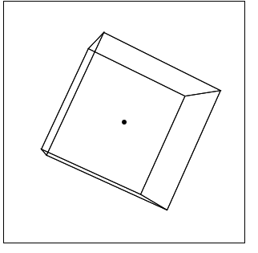

# canvas3d
canvas 3d permits to display elements in 3d on a canvas

read the documentation https://github.com/flamebousteur/canvas3d/wiki/doc

example:
```js
import { canvas, camera, canvas3D } from "./canvas3D.js";

window.onload = function() {
	// create a canvas with 3d components
	let canvas = new canvas3D(document.querySelector("canvas"));
	// rotate objects around the center of the canvas
	// rotateangle = [ x, y, z ]
	canvas.camera.rotateangle = [25, 0, 10];
	// set the lines/face of the cube. the vertex will be moved to meet the perspective
	// setlines = [ [ x, y, z ], [ x, y, z ] ]
	canvas.setlines([
		[-1, -1, -1],
		[-1, -1, 1],
		[1, -1, 1],
		[1, -1, -1],
	])
	canvas.setlines([
		[-1, 1, -1],
		[-1, 1, 1],
		[1, 1, 1],
		[1, 1, -1],
	])
	canvas.setlines([
		[-1, -1, -1],
		[-1, 1, -1],
		[1, 1, -1],
		[1, -1, -1],
	])
	canvas.setlines([
		[-1, -1, 1],
		[-1, 1, 1],
		[1, 1, 1],
		[1, -1, 1],
	])
	canvas.setlines([
		[-1, -1, -1],
		[-1, -1, 1],
		[-1, 1, 1],
		[-1, 1, -1],
	])
	canvas.setlines([
		[1, -1, -1],
		[1, -1, 1],
		[1, 1, 1],
		[1, 1, -1],
	])
	// set a point at the center of the canvas
	canvas.setpoint([0, 0, 0])
}
```

